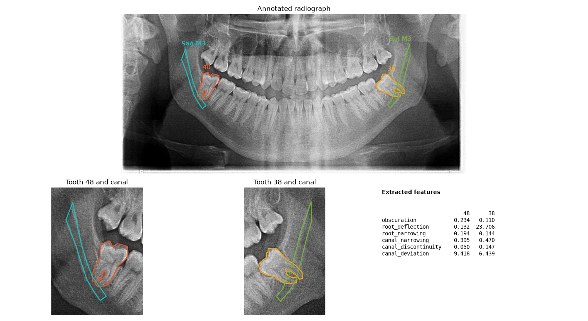

# Panoramic Features

Feature extraction for **lower third molars and the mandibular canal** in panoramic
radiographs. Given a radiograph and polygons drawn around teeth 48 and 38 and the canal beside
them, it computes six radiographic features that are commonly associated with the risk of
inferior alveolar nerve injury, and writes them to an Excel or CSV table — one row per tooth,
ready for statistics or a classifier.

**Version 1.0.0** · [Changelog](CHANGELOG.md) · [MIT License](#license)

```
Radiograph + XML polygons  →  Masks  →  Orient tooth, split roots  →  Six features  →  XLSX / CSV
```

It is classical image processing — no trained model, no GPU, no network access. A batch of
radiographs takes seconds, and the same input always gives the same output.



---

## Contents

- [What you get](#what-you-get)
- [Requirements](#requirements)
- [Installation A — Docker](#installation-a--docker)
- [Installation B — local, without Docker](#installation-b--local-without-docker)
- [Try it on synthetic data](#try-it-on-synthetic-data)
- [Input format](#input-format)
- [The features](#the-features)
- [Command line reference](#command-line-reference)
- [Python API](#python-api)
- [How it works](#how-it-works)
- [What a run produces](#what-a-run-produces)
- [Testing](#testing)
- [Troubleshooting](#troubleshooting)
- [Project layout](#project-layout)
- [License](#license)

---

## What you get

| | |
|---|---|
| **Six features per tooth** | Obscuration, root deflection, root narrowing, canal narrowing, canal discontinuity and canal deviation, for tooth 48 and tooth 38 |
| **Tolerant of bad input** | An unreadable image, a missing annotation or a failing feature is logged and skipped. It becomes an empty cell, never a crashed batch |
| **Reproducible** | Deterministic, no randomness. Thresholds are named constants, not magic numbers in the middle of a function |
| **Excel or CSV** | Output format follows the file extension; missing values can be written as empty cells or any number you choose |
| **Three ways to run** | Command line, Docker image, or a small Python API |
| **Tested and linted** | Unit tests on synthetic geometry, an end-to-end CLI test, `ruff`, and CI on Python 3.10–3.13 |

---

## Requirements

| | |
|---|---|
| Python | 3.10 or newer (local install) |
| Docker | Engine 24+ (Docker route) |
| Hardware | Any machine. No GPU is used; a few hundred MB of RAM is enough |
| Input | JPEG or PNG radiographs with one same-named XML annotation each |

---

## Installation A — Docker

The image contains everything; nothing is installed on the host.

```bash
git clone https://github.com/berkay-durmus/Feature-Extraction-in-Panoramic-Radiography-Images.git
cd Feature-Extraction-in-Panoramic-Radiography-Images
docker build -t panoramic-features .
```

Put your images and `.xml` files in `./data`, then:

```bash
mkdir -p output
docker run --rm --user "$(id -u):$(id -g)" \
  -v "$PWD/data:/data:ro" -v "$PWD/output:/output" \
  panoramic-features
```

The result is `output/FeatureList.xlsx`. Anything after the image name is passed to the
program, so options work as usual:

```bash
docker run --rm --user "$(id -u):$(id -g)" \
  -v "$PWD/data:/data:ro" -v "$PWD/output:/output" \
  panoramic-features /data -o /output/features.csv --missing -1 -v
```

With Compose, or through `make`:

```bash
DATA_DIR=./data docker compose run --rm panoramic-features
make docker-build && make docker-run
```

`--user` makes the output file belong to you rather than to the container's user. The image is
multi-stage, based on `python:3.12-slim`, and runs as a non-root user.

---

## Installation B — local, without Docker

```bash
git clone https://github.com/berkay-durmus/Feature-Extraction-in-Panoramic-Radiography-Images.git
cd Feature-Extraction-in-Panoramic-Radiography-Images

python -m venv .venv
source .venv/bin/activate            # Windows: .venv\Scripts\activate
pip install -e .                     # add ".[dev]" for tests, linting and the figure script
```

Check:

```bash
panoramic-features --version
```

Then:

```bash
panoramic-features path/to/data -o FeatureList.xlsx
```

---

## Try it on synthetic data

No radiographs at hand? Generate a few artificial ones with matching annotations:

```bash
python scripts/make_dummy_dataset.py --out demo-data --count 6
panoramic-features demo-data -o demo.csv
```

The images are drawn shapes, not anatomy — they exist to exercise the pipeline and to show
what the output looks like. To render the overview figure for your own radiograph:

```bash
python scripts/make_figure.py 14.jpg 14.xml -o overview.png    # needs pip install -e ".[dev]"
```

---

## Input format

One folder holding each radiograph next to its annotation, sharing the file name stem:

```
data/
├── 1.jpg    1.xml
├── 2.jpg    2.xml
└── 10.png   10.xml
```

Images may be `.jpg`, `.jpeg` or `.png` and are read as 8-bit grayscale. Files are processed in
natural order (`2` before `10`). An image without an `.xml` partner, or the reverse, is
reported and skipped.

Annotations are XML files with polygons under `outputs/object/item`; each item carries a
`name` and a `polygon` with numbered points:

```xml
<annotation><outputs><object>
  <item>
    <name>48</name>
    <polygon><x1>1032</x1><y1>410</y1><x2>1101</x2><y2>402</y2> ... </polygon>
  </item>
</object></outputs></annotation>
```

| Label | Meaning |
|---|---|
| `48` | Right lower third molar (appears on the image's left) |
| `Sağ M3` | Mandibular canal beside the right third molar |
| `38` | Left lower third molar |
| `Sol M3` | Mandibular canal beside the left third molar |

Labels may be missing: a tooth without a canal still gets its root features, and a canal
without a tooth still gets its canal features. A label with several polygons is treated as the
union of them.

---

## The features

| Column | Meaning |
|---|---|
| `Obscuration` | Contrast `(R − m) / (R + m)` between the tooth/canal overlap (mean intensity `m`) and the reference tooth density `R`, the middle multi-Otsu threshold of the rest of the tooth. Positive when the overlap is darker |
| `Deflection` | Largest bend angle, in degrees, of a root: the angle between its coronal-to-middle and middle-to-apical direction (0 = straight), after the tooth is oriented with its roots pointing down |
| `NarrowingRoots` | Largest relative loss of width over 10% of a root's length. 0 means no narrowing, 1 means the root is pinched off |
| `NarrowingCanal` | `1 − w_low / w_high`: how much narrower the canal gets, comparing the 5th and 95th percentile of its width along the centreline |
| `DiscontinuityCanal` | Fraction of the canal outline that lies inside the tooth polygon |
| `CanalDeviation` | Standard deviation, in degrees, of the local direction of the canal centreline |

A value that cannot be computed — a missing polygon, a canal too short, a tooth without
distinguishable roots — is left empty (or set with `--missing`). The table has columns
`ImageNumber`, `Tooth` (`48` or `38`) and the six above.

The thresholds behind these definitions are constants at the top of the modules in
`src/panoramic_features/features/`. They were chosen to behave sensibly on synthetic shapes and
checked on a single real radiograph; they have **not been tuned or validated on clinical data**; check the intermediate results on a few
real cases before relying on the numbers.

---

## Command line reference

```
panoramic-features INPUT_DIR [-o OUTPUT] [--missing VALUE] [-v] [--version]
```

| Option | Description |
|---|---|
| `INPUT_DIR` | Folder with images and same-named `.xml` files |
| `-o`, `--output` | `.xlsx` or `.csv` file (default `FeatureList.xlsx`) |
| `--missing VALUE` | Number written for values that cannot be computed (default: empty cell) |
| `-v`, `--verbose` | Debug logging, including the traceback of every failed feature |
| `--version` | Print the version and exit |

Exit codes: `0` rows written · `1` nothing to process · `2` input folder not found.

`python -m panoramic_features` is equivalent to the `panoramic-features` command.

---

## Python API

```python
from panoramic_features.pipeline import extract_features, process_folder
from panoramic_features.export import write_table

rows = extract_features("data/12.jpg", "data/12.xml")
rows[0].tooth  # "48"
rows[0].values  # {"obscuration": 0.21, "root_deflection": 12.4, ...}  (nan if missing)

write_table(process_folder("data"), "FeatureList.csv", missing=-1)
```

The individual functions in `panoramic_features.features` take plain boolean masks and a
grayscale image, so they can be used on their own.

---

## How it works

```
annotations.py   XML → {label: [polygon, ...]}
imaging.py       image loading, polygon → boolean mask
geometry.py      principal axis, rotation, tooth orientation
features/        obscuration.py  roots.py  canal.py
pipeline.py      pairs files, runs every feature, isolates failures
export.py        XLSX / CSV
cli.py           the command-line entry point
```

**Orientation.** The principal axis of the tooth polygon is rotated to vertical with the root
end downward. For near-horizontal (impacted) teeth the root end is assumed to point away from
the midline: image-left for tooth 48, image-right for tooth 38.

**Roots.** The lower half of the oriented tooth is kept. The roots are told apart by the
connected components of its apical part, where they have not yet merged, and the half is cut
midway between them. A tooth whose apical part is a single component is treated as one root.

**Canal.** The canal polygon is skeletonised, the skeleton is ordered along its principal axis
and the canal width is read from a distance transform. Ten percent of each end is discarded to
avoid the polygon's end caps.

**Failure isolation.** Every feature runs in its own `try` block. A failure is logged with the
image and tooth and becomes `NaN` for that one cell; nothing else in the batch is affected.

---

## What a run produces

```
FeatureList.xlsx      sheet "Features"; one row per tooth, two rows per image
```

| ImageNumber | Tooth | Obscuration | Deflection | NarrowingRoots | NarrowingCanal | DiscontinuityCanal | CanalDeviation |
|---|---|---|---|---|---|---|---|
| 14 | 48 | 0.234 | 0.132 | 0.194 | 0.395 | 0.050 | 9.418 |
| 14 | 38 | 0.110 | 23.706 | 0.144 | 0.470 | 0.147 | 6.439 |

(The two rows for the radiograph shown at the top of this page.)

---

## Testing

```bash
pip install -e ".[dev]"
pytest                               # 18+ tests, a few seconds
ruff check . && ruff format --check .
```

The tests build their own geometry — straight and bent roots, uniform and tapered canals, a
rotated tooth, a missing polygon — so no real radiographs are needed. The CLI test runs the
whole pipeline on generated files and reads the XLSX and CSV back. CI runs the same checks on
Python 3.10–3.13 and builds the Docker image.

---

## Troubleshooting

| Symptom | Cause and fix |
|---|---|
| `No image/annotation pairs found` | Images and XML files must share their file name stem (`12.jpg` + `12.xml`) and sit in the same folder |
| `WARNING No annotation for 12.jpg` | There is no `12.xml` next to it; the image is skipped |
| A whole tooth row is empty | Its polygon is missing or lies outside the image. Check the label: `48`, `38`, `Sağ M3` or `Sol M3`, exactly |
| Only one column is empty | That feature failed; run with `-v` to see the traceback and the image it came from |
| `CanalDeviation` / `NarrowingCanal` empty | The canal polygon is too short for a centreline (under about 30 pixels long) |
| `Deflection` empty on a tooth | Fewer than 40 pixels in a root, or the roots could not be told apart. Check the polygon covers the roots |
| Excel shows `-1` where cells should be empty | The run used `--missing -1`; omit it for empty cells |
| Output file owned by root (Docker) | Add `--user "$(id -u):$(id -g)"` to `docker run` |
| `Permission denied` writing `/output` (Docker) | Create the folder first (`mkdir -p output`) and run with `--user` as shown above |
| `ModuleNotFoundError: panoramic_features` | The package is not installed in the active environment: `pip install -e .` |

---

## Project layout

```
src/panoramic_features/
    annotations.py   imaging.py   geometry.py
    pipeline.py      export.py    cli.py
    features/        obscuration.py  roots.py  canal.py
tests/               unit tests on synthetic geometry, end-to-end CLI test
scripts/             make_dummy_dataset.py  make_figure.py
docs/images/         overview.png
Dockerfile  docker-compose.yml  Makefile  pyproject.toml
.github/workflows/   ci.yml
```

---

## License

Released under the [MIT License](LICENSE). Copyright 2024 Berkay Ahmet Durmuş.

---

The radiograph in the figure is one annotated image from the author's thesis dataset; it
carries no identifying text. Do not commit raw patient data to this repository. The synthetic
generator in `scripts/make_dummy_dataset.py` is there so that examples and tests don't need any.
